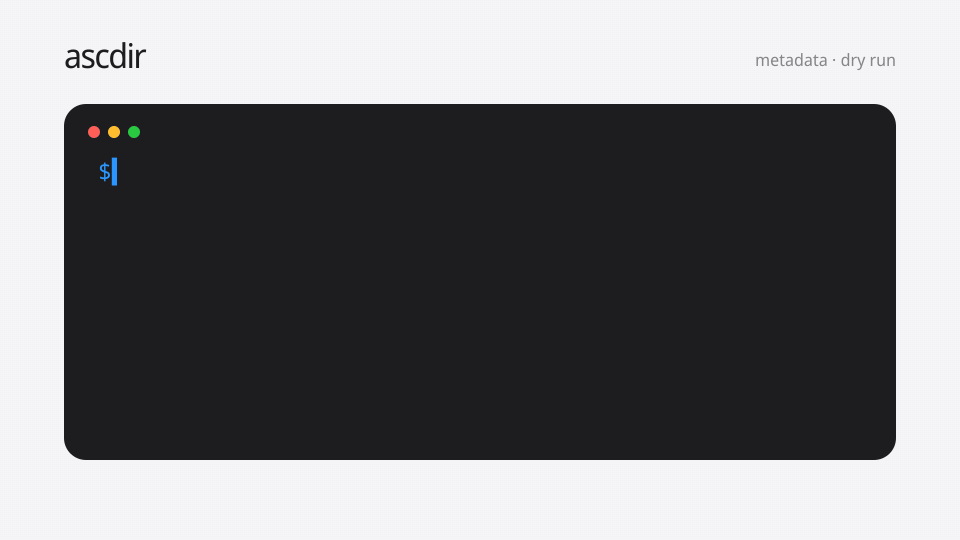

# ascdir

`ascdir` makes recurring App Store release workflows reviewable. It manages
App Store Connect metadata and product-page assets as files, previews changes
before applying them, distributes processed builds through TestFlight, and
submits versions for App Review.



## Features

- Keep short values in self-documenting YAML and long-form content in Markdown
- Pull existing metadata from App Store Connect
- Preview concise field- and asset-level changes before writing with `push --dry-run`
- Protect non-empty remote fields from accidental clearing
- Validate common App Store character limits and URLs locally
- Manage multiple locales from one `ascdir.yaml`
- Authenticate with App Store Connect API keys
- Create an App Store version, select a processed build, and submit it for review
- Release an approved manual-release version without opening App Store Connect
- Distribute an uploaded build to existing internal or external TestFlight groups
- Follow paginated responses and retry rate limits and transient failures
- Run without telemetry or credential uploads

## Installation

With Homebrew on macOS or Linux:

```sh
brew install Arata1202/tap/ascdir
```

With [aqua](https://aquaproj.github.io/):

Initialize the project first if the current directory does not already contain an `aqua.yaml`:

```sh
aqua init
```

Then add and install ascdir:

```sh
aqua g -i Arata1202/ascdir
aqua install
```

With [mise](https://mise.jdx.dev/) through its aqua backend:

```sh
mise use -g aqua:Arata1202/ascdir
```

Download the archive for your platform from [GitHub Releases](https://github.com/Arata1202/ascdir/releases/latest), extract it, and place `ascdir` (or `ascdir.exe` on Windows) on your `PATH`.

On macOS or Linux, the checksum-verifying installer can do this automatically:

```sh
curl -fsSLO https://github.com/Arata1202/ascdir/releases/latest/download/install.sh
sh install.sh
rm install.sh
```

Set `ASCDIR_VERSION` to pin the installer in automation:

```sh
ASCDIR_VERSION=v1.2.1 sh install.sh
```

For example, in GitHub Actions:

```yaml
- name: Install ascdir
  env:
    ASCDIR_VERSION: v1.2.1
  run: |
    curl -fsSLO "https://github.com/Arata1202/ascdir/releases/download/${ASCDIR_VERSION}/install.sh"
    sh install.sh
    rm install.sh
```

Verify the archive before extracting it:

```sh
# Linux
sha256sum --check checksums.txt --ignore-missing

# macOS
shasum -a 256 ascdir_*.tar.gz

# Windows PowerShell
Get-FileHash .\ascdir_*.zip -Algorithm SHA256
```

Compare the printed digest with the corresponding entry in `checksums.txt`.

Release archives also have signed build provenance generated by GitHub Actions. With the [GitHub CLI](https://cli.github.com/), verify that an archive was built by this repository:

```sh
gh attestation verify ascdir_*.tar.gz --repo Arata1202/ascdir
```

Use the corresponding `.zip` filename on Windows. Each release also includes a software bill of materials (SBOM) for its archives.

Alternatively, install from source with Go 1.26.6 or later:

```sh
go install github.com/Arata1202/ascdir/cmd/ascdir@latest
```

To build the current source tree instead:

```sh
git clone https://github.com/Arata1202/ascdir.git
cd ascdir
make build
```

Release binaries support macOS, Linux, and Windows on AMD64 and ARM64. The installer supports macOS and Linux; use Homebrew, aqua, mise, `go install`, or a release archive on other systems.

## Authentication

Create an App Store Connect API key, download its `.p8` private key once, and run:

```sh
ascdir auth login
ascdir auth check
```

The login command stores the issuer ID, key ID, and absolute path to the private key in your user configuration directory. The private key itself is not copied. For CI or temporary overrides, set:

```sh
export ASC_ISSUER_ID="00000000-0000-0000-0000-000000000000"
export ASC_KEY_ID="ABC123DEFG"
export ASC_PRIVATE_KEY_PATH="$HOME/.private_keys/AuthKey_ABC123DEFG.p8"
```

Never commit the private key. `ascdir` ignores `*.p8` and `.env` by default, but credentials should still be stored outside the repository or in a CI secret store.

The HTTP timeout defaults to 10 minutes so large App Preview transfers can complete on slower connections. Set `ASCDIR_TIMEOUT` to a positive Go duration such as `15m` when needed.

Remove locally stored credentials without deleting the `.p8` private key:

```sh
ascdir auth logout
```

## Quick start

Initialize a project from an existing App Store version:

```sh
ascdir init \
  --bundle-id com.example.myapp \
  --platform IOS \
  --version 1.2.0
```

This creates `ascdir.yaml` with short metadata values and downloads long-form content under `metadata/`. All configured paths are relative to the directory containing `ascdir.yaml`. A project that also opts into asset management commonly has this layout:

```text
project/
  ascdir.yaml
  metadata/
    en-US/
      description.md
      promotional_text.md
      whats_new.md
  assets/
    screenshots/
    app-previews/
```

`privacy_policy.md` is generated only for `TV_OS`. A custom `license_agreement.md` is present only when the project manages a custom EULA.

After creating the project, `init` groups empty managed values by their YAML or file location and prints the exact `check` and `push --dry-run` commands to run next. The [minimal example](examples/ascdir.minimal.yaml) is a safe starting point. Copy only the fields you want ascdir to manage; omitted fields remain unchanged in App Store Connect.

Edit the YAML or long-form text files, validate them, and preview the remote changes:

```sh
ascdir check
ascdir push --dry-run
```

Apply the changes:

```sh
ascdir push
```

Once Xcode or your build pipeline has uploaded a processed build, preview and
run the recurring release workflow from the same project:

```sh
# TestFlight
ascdir testflight distribute --group "Internal Team" --dry-run
ascdir testflight distribute --group "Internal Team" --confirm 1.2.0

# App Store review, then manual publication after approval
ascdir app-store submit --dry-run
ascdir app-store submit --confirm 1.2.0
ascdir app-store release --dry-run
ascdir app-store release --confirm 1.2.0
```

The version passed to `--confirm` must match `app.version`. Dry runs and status
commands are read-only. See [App Store submission and release](docs/release.md)
and [TestFlight distribution](docs/testflight-distribution.md) before the first
production run.

To replace managed local values with the current App Store Connect values:

```sh
ascdir pull --dry-run
ascdir pull
```

If the remote state would remove local screenshots or App Previews, review the
dry run and confirm with `ascdir pull --allow-local-asset-deletions`.

## Configuration

Most projects only need the app identity and the localization fields generated
by `ascdir init`. The remaining sections below are opt-in:
remove any key you do not want ascdir to manage. Age ratings, accessibility
declarations, a custom EULA, media assets, availability, and pricing are
advanced workflows with dedicated guides.

```yaml
version: "2"
app:
  id: "123456789"
  bundle_id: com.example.myapp
  platform: IOS
  version: 1.2.0
metadata:
  copyright: "2026 Example, Inc." # Year and rights holder, for example: 2026 Example, Inc.
categories:
  primary_category: PRODUCTIVITY # Required top-level App Store category ID
localizations:
  en-US:
    values:
      name: Example App # App Store display name, up to 30 characters
      subtitle: A concise summary # Short summary displayed below the name, up to 30 characters
      keywords: example,productivity # Comma-separated search keywords, up to 100 bytes
      support_url: https://example.com/support # Public HTTP(S) support page
      marketing_url: https://example.com # Optional public HTTP(S) marketing page
      privacy_policy_url: https://example.com/privacy # Public HTTP(S) privacy policy
      privacy_choices_url: "" # Optional public HTTP(S) privacy choices page
    files:
      description: metadata/en-US/description.md # Required plain-text product description; Markdown is not rendered
      promotional_text: metadata/en-US/promotional_text.md # Optional plain-text promotion, up to 170 characters
      whats_new: metadata/en-US/whats_new.md # Plain-text release notes; required for app updates
      privacy_policy_text: metadata/en-US/privacy_policy.md # Required plain-text tvOS privacy policy; TV_OS only
```

Start from the [minimal example](examples/ascdir.minimal.yaml) and add only the
advanced sections documented under [Managed metadata](#managed-metadata) when
opting into assets, age ratings, accessibility declarations, licensing,
availability, or pricing.

Find valid price-point IDs without changing App Store state:

```sh
ascdir price-points --territory USA
```

Short, single-line values live under `values`, where the key and generated inline comment describe the expected input. Long-form values live in files referenced under `files`. The `.md` extension makes them convenient to review on GitHub; ascdir sends their contents as plain text, so Markdown and HTML formatting are not rendered by the App Store. Paths are relative to the directory containing `ascdir.yaml`.

Remove a key to leave that field unmanaged. An explicitly empty value remains managed and represents a request to clear the remote field; `push` still requires `--allow-empty` when the remote value is non-empty.

Version 1 configurations remain fully supported. Existing projects can continue using one file per field without modification; newly initialized projects use version 2. To migrate manually, move short values into `values`, keep long-form paths under `files`, and change `version` to `"2"`.

Unknown configuration keys are rejected so misspelled fields cannot be silently ignored. During `pull`, ascdir updates only managed values and preserves YAML comments and key order. Configuration, metadata, and asset replacements are staged and committed as one recoverable local transaction.

Supported platforms are `IOS`, `MAC_OS`, `TV_OS`, and `VISION_OS`.

## Managed metadata

Non-localized fields:

- Version copyright
- App accessibility URL
- Content rights declaration
- Primary and secondary categories
- Games and Stickers subcategories
- Age rating declaration, including Made for Kids
- Accessibility Nutrition Labels for each device family
- Custom end-user license agreement text and territories
- App screenshots, including locale, display type, and order
- App Preview videos, display order, and optional poster-frame timecodes
- Territory availability, release dates, and preorder settings
- Base-territory pricing and scheduled price changes

App-level localization fields:

- Name and subtitle
- Privacy policy URL and text
- Privacy choices URL

Version-level localization fields:

- Description and keywords
- Promotional text and what's new text
- Support URL and marketing URL

See [Text metadata](docs/metadata.md) for the purpose, requirement, and editing lifecycle of every generated long-form file. Complex managed resources have dedicated guides for [screenshots](docs/screenshots.md), [App Previews](docs/app-previews.md), [age ratings](docs/age-rating.md), [accessibility](docs/accessibility.md), [custom license agreements](docs/license-agreement.md), [availability](docs/availability.md), and [pricing](docs/pricing.md).

When a configured locale does not exist remotely, `push` creates both the app-level and version-level localization resources in the order required by App Store Connect.

## Commands

### `ascdir auth check`

Validates the configured private key, creates a short-lived JWT locally, and performs a read-only API request.

### `ascdir auth login`

Prompts for the issuer ID, key ID, and `.p8` path, validates the private key, and saves the configuration with user-only file permissions. On Unix systems, ascdir warns when the private key is readable by other users.

### `ascdir auth logout`

Removes the credentials saved by `auth login`. It never deletes the `.p8` private key. Environment variables remain untouched.

### `ascdir init`

Finds an existing app and version, generates the configuration, and pulls its localizations. It refuses to overwrite an existing configuration unless `--force` is supplied.

### `ascdir pull`

Downloads configured fields into `ascdir.yaml`, referenced Markdown files, and managed asset directories. Local edits are overwritten, so commit or review them first. Use `pull --dry-run` to preview the local differences without writing files. If the plan removes local assets, rerun with `--allow-local-asset-deletions` after reviewing the deletion.

### `ascdir push`

Validates and compares local metadata and assets with App Store Connect, then updates only changed resources. Use `--dry-run` to inspect changes without writing.

Clearing a non-empty remote field requires the explicit `--allow-empty` flag:

```sh
ascdir push --dry-run
ascdir push --allow-empty
```

Changing `age_rating.kids_age_band` may become irreversible after App Review, so it also requires explicit confirmation:

```sh
ascdir push --dry-run
ascdir push --allow-irreversible
```

See [Age rating configuration](docs/age-rating.md) for every supported declaration and enum value.

Publishing an Accessibility Nutrition Label also requires `--allow-irreversible`. See [Accessibility declaration configuration](docs/accessibility.md).

Apple only permits most version metadata to change while the version is in an editable state. API errors are returned without hiding Apple's error code or detail.

App Store Connect does not provide transactions across resource types. ascdir validates and stages the complete plan before writing, creates required localization resources before their assets, and applies availability and pricing changes last. If Apple rejects a later request, earlier successful requests remain applied. Review the error, rerun `ascdir push --dry-run` to inspect the remaining difference, and then retry.

### `ascdir check`

Checks the configuration, required files, common character limits, and HTTP(S) URLs without contacting App Store Connect.

### `ascdir app-store status`

Shows the configured App Store version, selected build, review submission state, and release type without changing App Store Connect. Use `--json` for machine-readable output.

```sh
ascdir app-store status
ascdir app-store status --json
```

### `ascdir app-store submit`

Builds a read-only plan, then converges the configured version toward submission. If the App Store version does not exist, the first confirmed run creates only that version and stops so metadata can be synchronized safely. A later run selects a valid build, creates or resumes a compatible draft Review Submission, adds the version, and submits it for App Review.

Preview the exact operations first. If `--build` is omitted, ascdir selects the newest valid, unexpired build for the configured platform and version.

```sh
ascdir app-store submit --dry-run
ascdir app-store submit --build 42 --dry-run
```

Execution requires the configured version as an explicit confirmation token:

```sh
ascdir app-store submit --build 42 --confirm 1.2.0
```

New versions default to `MANUAL`; existing versions preserve their current release setting unless `--release-type` is supplied. `AFTER_APPROVAL` releases automatically after approval. `SCHEDULED` also requires `--earliest-release-date` in RFC3339 format. Rerunning the command after submission is a no-op rather than creating a duplicate submission.

### `ascdir app-store release`

Requests publication of a version in `PENDING_DEVELOPER_RELEASE`. It is only valid for a manual-release version and is a no-op once release processing has started.

```sh
ascdir app-store release --dry-run
ascdir app-store release --confirm 1.2.0
```

Review [App Store submission and release](docs/release.md) before the first production run. Build upload, signing, and archive creation remain the responsibility of Xcode, Transporter, or another build pipeline.

### `ascdir testflight status`

Lists builds for the configured platform and prerelease version, newest first, without changing TestFlight. Use `--json` for machine-readable output.

```sh
ascdir testflight status
ascdir testflight status --json
```

### `ascdir testflight distribute`

Distributes an uploaded, valid build to existing TestFlight groups. Group names are exact and `--group` is repeatable; ascdir never creates groups or testers.

```sh
ascdir testflight distribute --group "Internal Team" --dry-run
ascdir testflight distribute --group "Internal Team" --confirm 1.2.0
```

Use `--build 42` to pin a build; otherwise the newest valid, unexpired build for the configured platform and version is selected. Internal groups require only build attachment. If any requested group is external, ascdir inspects the build's Beta App Review submission and creates one only when absent or rejected. Existing `WAITING_FOR_REVIEW`, `IN_REVIEW`, or `APPROVED` submissions are reused.

Execution revalidates the complete plan immediately before mutation and requires the configured version through `--confirm`. See [TestFlight distribution](docs/testflight-distribution.md) for prerequisites and recovery behavior.

### `ascdir completion`

Prints shell completion for Bash, Zsh, Fish, or PowerShell. For example, enable Zsh completion for the current session with:

```sh
source <(ascdir completion zsh)
```

## Troubleshooting

See [Troubleshooting](docs/troubleshooting.md) for configuration discovery, authentication, editable-version restrictions, confirmation flags, and recovery after a partially applied push.

## Scope

`ascdir` manages App Store Connect metadata and product-page assets, can distribute existing builds through TestFlight groups, and can submit and manually release an App Store version. It does not upload or sign app builds, create TestFlight groups or testers, or manage certificates, subscriptions, analytics, or customer reviews.

The intended boundary is the recurring release work of an individual developer
or small team. Initial Apple agreements, tax and banking setup, certificates,
profiles, archive creation, signing, and build upload stay in Apple tooling or
the existing build pipeline. See [Product scope](docs/scope.md) for the detailed
supported and deferred areas.

## Security

- Authentication uses short-lived ES256 JSON Web Tokens generated locally.
- The `.p8` private key is read from the configured local path and never leaves the machine. Apple receives only the signed JWT.
- API errors are reported without printing credentials or JWTs.
- `push --dry-run` never sends mutation requests.
- `app-store submit --dry-run` and `app-store release --dry-run` never send mutation requests; execution is bound to the configured version with `--confirm`.
- `testflight distribute --dry-run` never sends mutation requests; confirmed execution only attaches the selected build to resolved existing groups and, for external testing, submits that build for Beta App Review when needed.
- Pagination links are restricted to the configured App Store Connect API origin, preventing bearer tokens from being forwarded to another host.
- Metadata paths are confined to the configuration directory after resolving symbolic links.
- Retried mutations are limited to idempotent updates and requests rejected by rate limiting.
- ascdir collects no telemetry.

## Development

```sh
make fmt
make check
make build
```

Tests use generated keys and local HTTP servers. They never require real App Store Connect credentials or contact the production API.

See [CONTRIBUTING.md](CONTRIBUTING.md) for contribution guidelines, [CODE_OF_CONDUCT.md](CODE_OF_CONDUCT.md) for community expectations, and [SECURITY.md](SECURITY.md) for private vulnerability reporting.

## License

MIT

This is an independent, unofficial project and is not affiliated with, endorsed by, or sponsored by Apple Inc. App Store Connect is a trademark of Apple Inc.
